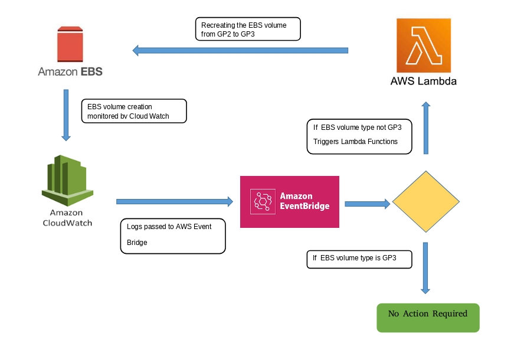
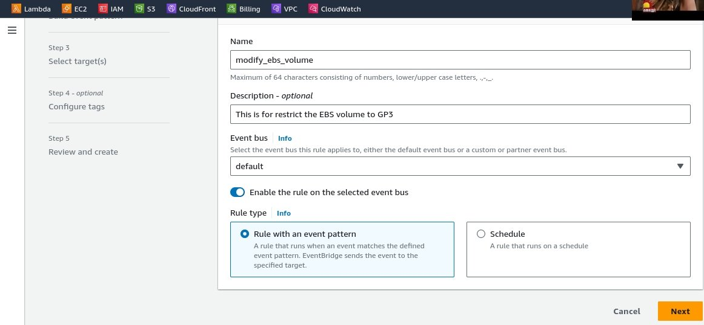
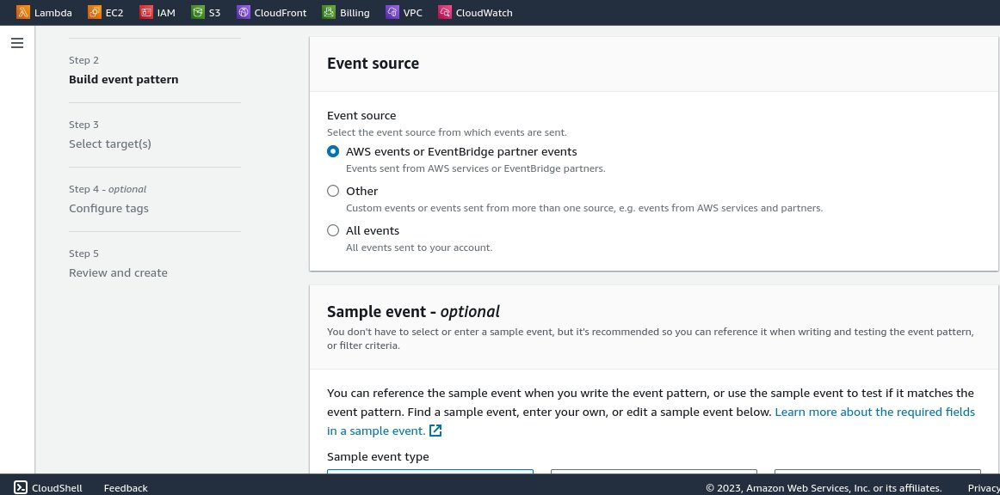
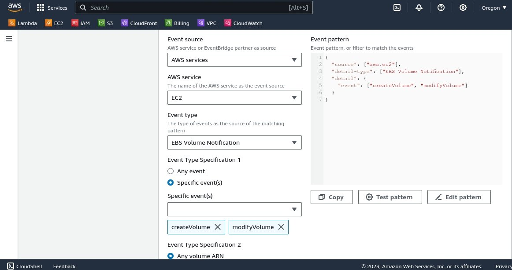
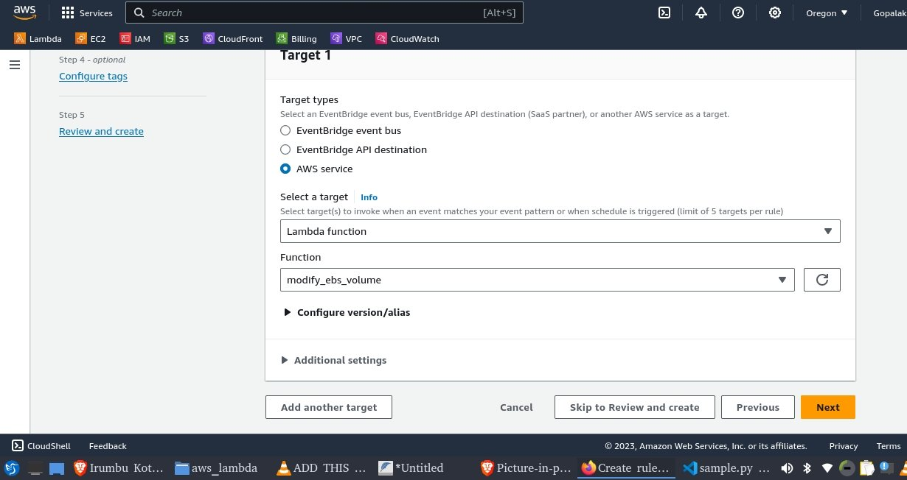
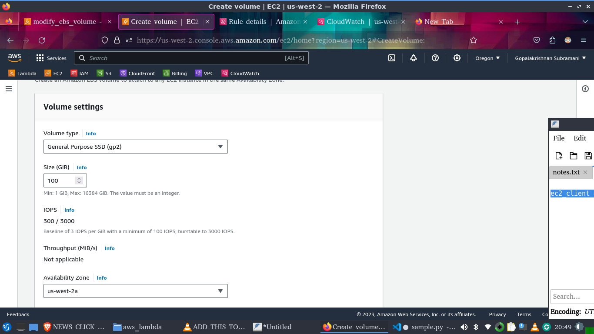
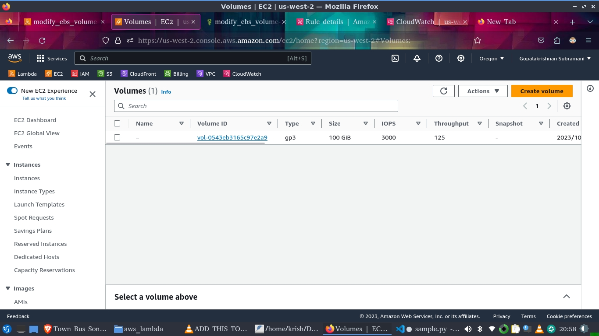

# Restrict EBS volume type using AWS Lambda function and CloudWatch 💵💳

## 🎯 PROJECT DESCRIPTION

As a Cloud Engineering team we take care of the AWS environment and make sure it is in compliance with the organizational policies.
We use AWS cloud watch in combination with AWS Lambda to govern the resources according to the policies.
For example, we Trigger a Lambda function when an Amazon Elastic Block Store (EBS) volume is created. We use Amazon CloudWatch Events. CloudWatch Events that allows us to monitor and respond to EBS volumes that are of type GP2 and convert them to type GP3.

<p align="center">
  
</p>

## 🏁 Technology Stack

* [AWS](https://pytorch.org/)
* [Python](https://python.org/)


## 📌 Prerequisites

* Create Lambda function, 
* Create Cloud Watch,
* Integrate lambda function with cloud watch,
* Lambda function is triggered by cloud watch when EBS created


## 💵 Lambda Function
Create AWS Lambda function with the following configuration
* Function name → modify_ebs_volume
* Runtime → python 3.7

### In Deploy
Event name → test
Then “test” the function to ensure it running correctly

## 🎯 Cloud Watch
Configure the rule in AWS Event bridge which trigger the Lambda function by following below steps

<p align="center">
  
</p>

<p align="center">
  
</p>

<p align="center">
  
</p>

<p align="center">
  
</p>

## 🎯 EBS

In volumes create new volume , then check the log groups in CloudWatch which triggers the lambda function 

<p align="center">
  
</p>

## 🎯 Python Code for Lambda Function
Add the following code in lambda function which ensures the EBS volume type while creating


```sh
import boto3

def get_volume_id_from_arn(volume_arn):
    
    #Split the ARN using the colon seperator
    arn_parts = volume_arn.split(':')
    
    #The volume ID is the last part of the ARN after the 'volume/' prefix
    volume_id = arn_parts[-1].split('/')[-1]
    
    return volume_id

def lambda_handler(event, context):
    
    vol_arn = event['resources'][0]
    vol_id = get_volume_id_from_arn(vol_arn)


    ec2_client = boto3.client('ec2')
    
    response = ec2_client.modify_volume(
        VolumeId=vol_id,
        VolumeType='gp3',
    )
                         
```

## 🎯 IAM

* choose ebs_vol_check role
* Then add necessary permissions to perform the defined task
 
 
## 📋 Verify the Project

Once the above said steps done, create a new EBS volume with the General Purpose SSD (gp2). Watch out after some time it will changes to gp3 type as follows

<p align="center">
  
</p>
     
## 📜 LICENSE

[MIT](https://github.com/git/git-scm.com/blob/main/MIT-LICENSE.txt)
    
